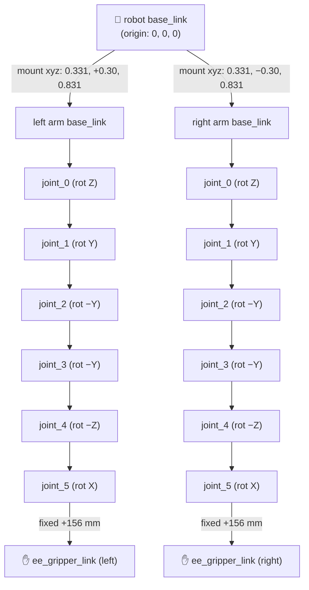
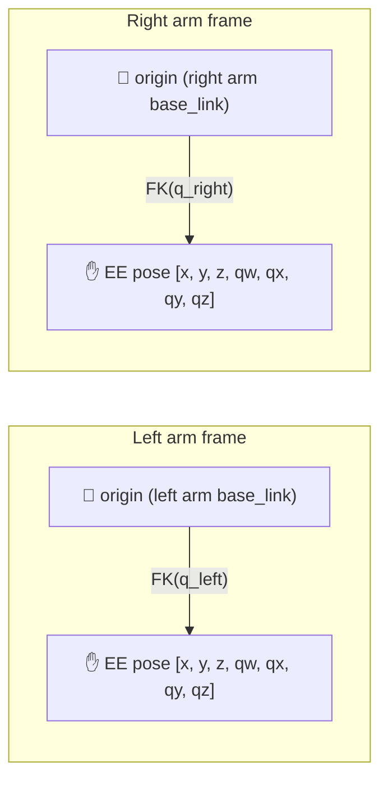
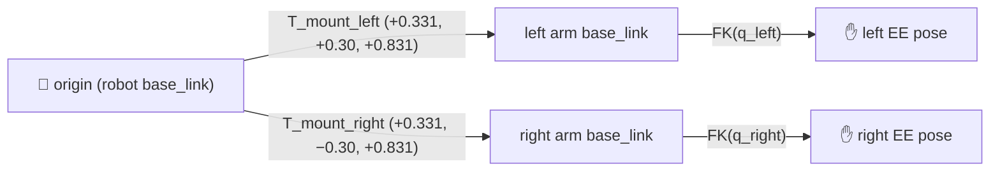
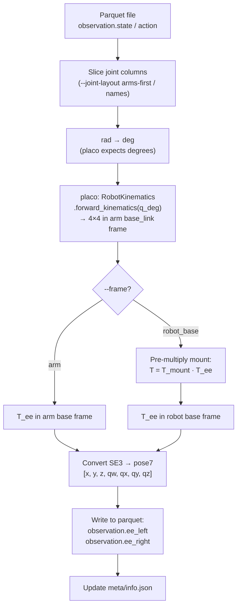
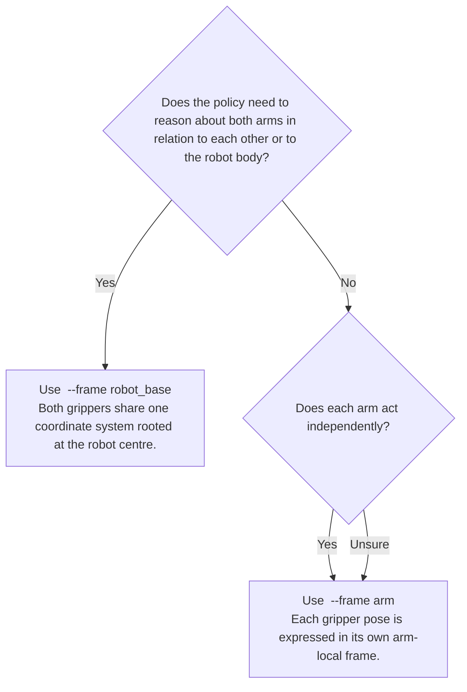

# End-Effector Conversion Guide

This guide explains how `joint-to-ee.py` computes end-effector (EE) poses from joint angles, the joint-column layout it expects, and how to choose between the two available reference frames.

---

## What is EE Conversion?

The robot stores joint angles at each timestep — one angle per motor. The end-effector conversion computes **where the gripper is in space** at each timestep by running forward kinematics (FK) through the arm's kinematic chain.

The result is added as new columns in every parquet file:

| Column | Values | Written when |
|---|---|---|
| `observation.ee_left` | `[x, y, z, qw, qx, qy, qz]` | Left arm joints found |
| `observation.ee_right` | `[x, y, z, qw, qx, qy, qz]` | Right arm joints found |
| `action.ee_left` | `[x, y, z, qw, qx, qy, qz]` | `--include-action` set |
| `action.ee_right` | `[x, y, z, qw, qx, qy, qz]` | `--include-action` set |

Each pose is a 7-element float32 vector: position `[x, y, z]` in metres, orientation as a quaternion `[qw, qx, qy, qz]`.

---

## Joint-Column Layout (read this first)

The wxai mobile_ai datasets carry **mislabeled** feature names in `meta/info.json`. The names claim indices `0..4` of `observation.state` are odom + base velocities, but the actual data starts at `left_joint_0`.

| Index | What the metadata claims | What it really is |
|---|---|---|
| `state[0..6]`   | `odom_x, odom_y, odom_theta, linear_vel, angular_vel, left_joint_0, left_joint_1` | `left_joint_0 … left_joint_6` |
| `state[7..13]`  | `left_joint_2 … right_joint_1` | `right_joint_0 … right_joint_6` |
| `state[14..18]` | `right_joint_2 … right_joint_6` | base info (odom + lin/ang vel) |
| `action[0..6]`  | `linear_vel, angular_vel, left_joint_0..4` | `left_joint_0 … left_joint_6` |
| `action[7..13]` | `left_joint_5..6, right_joint_0..4` | `right_joint_0 … right_joint_6` |
| `action[14..15]` | `right_joint_5, right_joint_6` | `linear_vel, angular_vel` |

`joint_6` is the gripper finger (prismatic) — excluded from FK; the EE is the `ee_gripper_link` fixed 156 mm past `link_6`.

### `--joint-layout` flag

- **`arms-first`** *(default)* — ignores the bad metadata and slices by index: left = `[0..5]`, right = `[7..12]`.
- **`names`** — uses the dataset's feature-name list. Only correct when you've verified the metadata is not mislabeled.

---

## Robot Structure

The Mobile AI robot has two WidowX AI (wxai) arms mounted on a wheeled base. Each arm connects to the robot through a fixed mount joint.



---

## The Two Reference Frames

The **reference frame** controls where the origin of the EE pose is.

### Frame: `arm`

The EE pose is expressed **relative to each arm's own `base_link`**.

- Origin = the base of the arm itself (where it bolts onto the mount)
- The left and right arms have **independent** coordinate systems
- The pose does not encode where the arm sits on the robot body
- **Not the default** — must be explicitly set with `--frame arm` or `ee_frame: arm`



**Use this when:** you want arm-local reasoning — e.g. "how far is the gripper from its own shoulder?" This is the natural frame for policies that treat each arm independently.

---

### Frame: `robot_base` *(default)*

The EE pose is expressed **relative to the robot's `base_link`**.

- Origin = centre of the robot body
- The mount offset is applied **after** the arm FK by left-multiplying with `T_mount`
- Both arms share the **same** coordinate system, so their poses can be directly compared



**Use this when:** you need both arms in a shared world frame — e.g. "how far apart are the two grippers?", or when the policy conditions on robot-relative gripper positions.

---

## How the Computation Works

FK is delegated to LeRobot's `RobotKinematics` (a thin wrapper over the [placo](https://placo.readthedocs.io/) C++ solver). We load the single-arm URDF (`wxai_follower.urdf`) so the solver yields poses in each arm's own `base_link` frame; the mount offset is applied separately for the `robot_base` frame.

```python
from lerobot.model.kinematics import RobotKinematics

kin = RobotKinematics(
    urdf_path="…/wxai_follower.urdf",
    target_frame_name="ee_gripper_link",
    joint_names=[f"joint_{i}" for i in range(6)],
)

# joints (radians) → 4×4 SE3 in arm base_link frame
# NOTE: RobotKinematics.forward_kinematics expects DEGREES
T_arm = kin.forward_kinematics(np.rad2deg(q))

# Optional: prepend mount transform for robot_base frame
T_robot = T_mount @ T_arm   # T_mount has identity rotation, just translation
```



The wxai single-arm URDF defines the chain natively — no joint axes / signs / offsets are hard-coded in the script any more:

| Joint | Origin offset (m) | Rotation axis (in URDF) |
|---|---|---|
| joint_0 | `[0.000, 0.000, 0.05725]` | `+Z` |
| joint_1 | `[0.020, 0.000, 0.04625]` | `+Y` |
| joint_2 | `[−0.264, 0.000, 0.000]` | `−Y` |
| joint_3 | `[0.245, 0.000, 0.060]` | `−Y` |
| joint_4 | `[0.06775, 0.000, 0.0455]` | `−Z` |
| joint_5 | `[0.02895, 0.000, −0.0455]` | `+X` |
| `ee_gripper` (fixed) | `[0.156062, 0.000, 0.000]` | — |

---

## Dependencies

```bash
pip install numpy scipy tqdm placo
# placo is bundled with LeRobot's `kinematics` optional extra:
# pip install 'lerobot[kinematics]'
```

The script auto-sets `ROS_PACKAGE_PATH=/home/edgeai/trossen_arm_ros` so placo can resolve `package://trossen_arm_description/…` mesh paths during URDF parsing. If your workspace lives elsewhere, edit `_TROSSEN_WORKSPACE` at the top of `joint-to-ee.py`, or set `ROS_PACKAGE_PATH` in your shell.

---

## Quick Decision Guide



---

## Running the Conversion

### Via `dataset-wizard.py` (recommended)

```yaml
# config.yaml
ee_frame: robot_base       # or arm
ee_include_action: false
start_from: ee_conversion
stop_at: ee_conversion
```

```bash
python dataset-wizard.py
# or override the frame from the CLI:
python dataset-wizard.py --start-from ee_conversion --stop-at ee_conversion --ee-frame robot_base
```

### Standalone

```bash
# Default: arms-first layout, robot_base frame, in-place
python joint-to-ee.py --dataset /path/to/dataset

# Use arm-local frame
python joint-to-ee.py --dataset /path/to/dataset --frame arm

# Also convert action joints
python joint-to-ee.py --dataset /path/to/dataset --include-action

# Write to a new directory instead of modifying in-place
python joint-to-ee.py --dataset /path/to/dataset --output /path/to/new-dataset

# Use the legacy name-based layout (only if you trust the dataset's feature names)
python joint-to-ee.py --dataset /path/to/dataset --joint-layout names
```

The script uses the LeRobot dataset API (`add_features`) internally: it writes a new dataset to a temporary directory, then swaps it with the original. This guarantees the source dataset is never partially written.

On start-up the script prints which column indices it resolved — confirm these match your dataset before letting it run:

```
joint layout: arms-first
  obs  left  → state[[0, 1, 2, 3, 4, 5]]
  obs  right → state[[7, 8, 9, 10, 11, 12]]
building placo kinematics from wxai_follower.urdf …
Computing EE poses (frame='robot_base', include_action=False) …
```

---

## Verifying the Output

```python
from lerobot.datasets.lerobot_dataset import LeRobotDataset

dataset = LeRobotDataset(repo_id="my-merged-dataset", root="/path/to/dataset")

print(dataset.meta.features.keys())
# Should include 'observation.ee_left', 'observation.ee_right'

frame = dataset[0]
print(frame["observation.ee_left"])   # tensor (7,): [x, y, z, qw, qx, qy, qz]
print(frame["observation.ee_right"])
```

Check `meta/info.json` — both new features appear under `"features"` with `"shape": [7]` and a description noting the chosen frame and the placo-based FK source.

---

## Why `RobotKinematics` (placo) instead of a hand-written chain?

The previous version of this script hard-coded the wxai joint axes, signs, and offsets in Python. It worked, but it tied dataset conversion to a frozen copy of the URDF — any change to `_wxai.urdf.xacro` would silently drift. Switching to `lerobot.model.kinematics.RobotKinematics` means:

- **Single source of truth**: the URDF defines the chain.
- **Reusable solver**: the same `RobotKinematics` powers the runtime `ForwardKinematicsJointsToEE` / `InverseKinematicsEEToJoints` processors used by LeRobot's online pipelines, so the offline data matches the online compute.
- **Less code**: no `_rot4` / `_trans4` / `_wxai_fk` to maintain.

The trade-off is two extra runtime dependencies (`placo`, `pinocchio`) and the need for `ROS_PACKAGE_PATH` to resolve `package://` mesh paths during URDF parsing.
