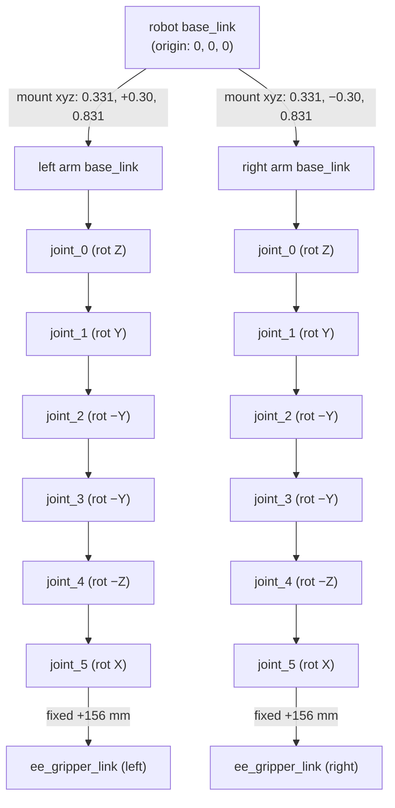
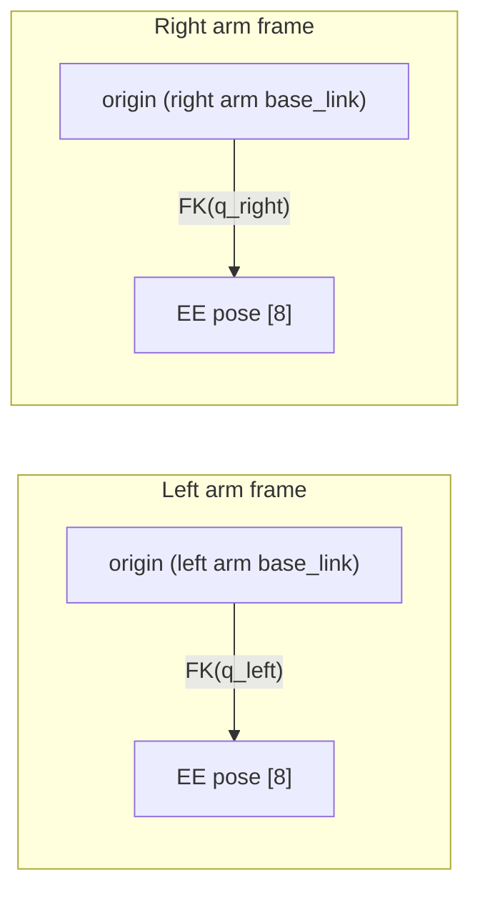
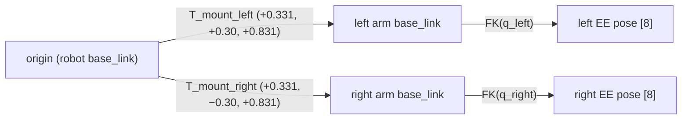
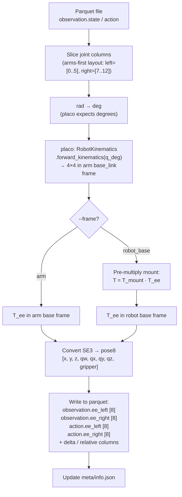
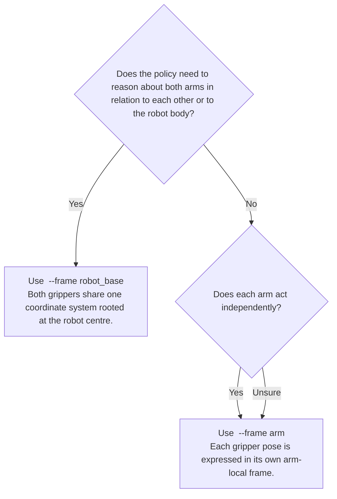

# End-Effector Conversion Guide

This guide explains how `joint_to_ee` computes end-effector (EE) poses from joint angles, the joint-column layout it expects, and how to choose between the two available reference frames.

---

## What is EE Conversion?

The robot stores joint angles at each timestep — one angle per motor. The end-effector conversion computes **where the gripper is in space** at each timestep by running forward kinematics (FK) through the arm's kinematic chain.

The result is added as new columns in every parquet file:

| Column | Shape | Contents |
|---|---|---|
| `observation.ee_left` | `[8]` | `x,y,z,qw,qx,qy,qz,gripper` — gripper∈[0,1] |
| `observation.ee_right` | `[8]` | same for right arm |
| `action.ee_left` | `[8]` | same, from action joints (**always** computed) |
| `action.ee_right` | `[8]` | same for right arm |
| `action.ee_left.delta` | `[8]` | `Δx,Δy,Δz, qrw,qrx,qry,qrz, Δgrip` — orientation = relative unit quaternion |
| `action.ee_left.delta.rotvec` | `[7]` | `Δx,Δy,Δz, rx,ry,rz, Δgrip` — orientation = rotation vector (rad) |
| `action.ee_left.relative` | `[8]` | quat form, action-EE vs obs-EE |
| `action.ee_left.relative.rotvec` | `[7]` | rotvec form |
| `action.ee_right.delta` | `[8]` | mirrors left |
| `action.ee_right.delta.rotvec` | `[7]` | mirrors left |
| `action.ee_right.relative` | `[8]` | mirrors left |
| `action.ee_right.relative.rotvec` | `[7]` | mirrors left |
| `action.delta` | `[16]` | joint-space sequential delta |
| `action.relative` | `[16]` | joint-space relative |

> **`--rot-repr` controls which delta/relative columns are written:**
> - `quat` → only the `[8]` columns (no `.rotvec` suffix)
> - `rotvec` → only the `[7]` form, written under the **base name** (no `.rotvec` suffix)
> - `both` (default) → both `[8]` and `[7]` columns

---

## Joint-Column Layout

The layout is **fixed** (arms-first). There is no `--joint-layout` flag.

| Index range | Contents |
|---|---|
| `observation.state[0..5]` | Left arm joints 0–5 (radians) |
| `observation.state[6]` | Left gripper (meters, normalized to [0,1] in EE vector) |
| `observation.state[7..12]` | Right arm joints 0–5 (radians) |
| `observation.state[13]` | Right gripper (meters, normalized to [0,1]) |
| `action[0..5]` | Left arm action joints |
| `action[6]` | Left gripper action |
| `action[7..12]` | Right arm action joints |
| `action[13]` | Right gripper action |

`joint_5` is the last revolute joint — the EE is the `ee_gripper_link` fixed 156 mm past `link_5`. The gripper finger value is extracted separately and appended as the 8th component of the EE vector.

---

## Robot Structure

The Mobile AI robot has two WidowX AI (wxai) arms mounted on a wheeled base. Each arm connects to the robot through a fixed mount joint.



### Mount transforms

These match the `follower_left/right_mount_joint` entries in `mobile_ai.urdf` exactly:

| Arm | Translation (m) | Rotation |
|---|---|---|
| Left | `[0.331, 0.3, 0.831]` | identity |
| Right | `[0.331, -0.3, 0.831]` | identity |

---

## The Two Reference Frames

The **reference frame** controls where the origin of the EE pose is.

### Frame: `arm`

The EE pose is expressed **relative to each arm's own `base_link`**.

- Origin = the base of the arm itself (where it bolts onto the mount)
- The left and right arms have **independent** coordinate systems
- The pose does not encode where the arm sits on the robot body
- Must be explicitly set with `--frame arm` or `ee_frame: arm`



**Use this when:** you want arm-local reasoning — e.g. "how far is the gripper from its own shoulder?" This is the natural frame for policies that treat each arm independently.

---

### Frame: `robot_base` *(default)*

The EE pose is expressed **relative to the robot's `base_link`**.

- Origin = centre of the robot body
- The mount offset is applied **after** the arm FK by left-multiplying with `T_mount`
- Both arms share the **same** coordinate system, so their poses can be directly compared



**Use this when:** you need both arms in a shared world frame — e.g. "how far apart are the two grippers?", or when the policy conditions on robot-relative gripper positions.

---

## How the Computation Works

FK is delegated to LeRobot's `RobotKinematics` (a thin wrapper over the [placo](https://placo.readthedocs.io/) C++ solver). We load the single-arm URDF (`wxai_follower.urdf`) so the solver yields poses in each arm's own `base_link` frame; the mount offset is applied separately for the `robot_base` frame.

```python
from lerobot.model.kinematics import RobotKinematics

kin = RobotKinematics(
    urdf_path="…/wxai_follower.urdf",
    target_frame_name="ee_gripper_link",
    joint_names=[f"joint_{i}" for i in range(6)],
)

# joints (radians) → 4×4 SE3 in arm base_link frame
# NOTE: RobotKinematics.forward_kinematics expects DEGREES
T_arm = kin.forward_kinematics(np.rad2deg(q))

# Optional: prepend mount transform for robot_base frame
T_robot = T_mount @ T_arm   # T_mount has identity rotation, just translation
```



The wxai single-arm URDF defines the chain natively — no joint axes / signs / offsets are hard-coded in the script:

| Joint | Origin offset (m) | Rotation axis (in URDF) |
|---|---|---|
| joint_0 | `[0.000, 0.000, 0.05725]` | `+Z` |
| joint_1 | `[0.020, 0.000, 0.04625]` | `+Y` |
| joint_2 | `[−0.264, 0.000, 0.000]` | `−Y` |
| joint_3 | `[0.245, 0.000, 0.060]` | `−Y` |
| joint_4 | `[0.06775, 0.000, 0.0455]` | `−Z` |
| joint_5 | `[0.02895, 0.000, −0.0455]` | `+X` |
| `ee_gripper` (fixed) | `[0.156062, 0.000, 0.000]` | — |

---

## Quaternion Convention and Orientation Math

### Convention

Throughout the codebase quaternions are stored as `[qw, qx, qy, qz]`. scipy's `Rotation.as_quat()` returns `[qx,qy,qz,qw]` — convert at the boundary before writing to parquet.

### Orientation delta/relative

EE delta and relative orientations are computed via the proper **relative rotation** formula:

```
R_rel = R_ref⁻¹ · R_cur
```

This is geometrically correct: it computes the rotation that takes the reference orientation to the current orientation. It always produces a valid unit quaternion regardless of the magnitude of the rotation change.

This replaced the older naive component-wise quaternion subtraction, which was only a valid approximation for small rotations and produced non-unit quaternions for larger changes.

The relative rotation is emitted in two forms (controlled by `--rot-repr`):

| Form | Dims | Description |
|---|---|---|
| Unit quaternion `[qrw,qrx,qry,qrz]` | 4 | Canonical form, `qrw ≥ 0`; combined with `[Δx,Δy,Δz,Δgrip]` → **8-dim** |
| Rotation vector `[rx,ry,rz]` | 3 | Axis × angle in radians (scipy `as_rotvec()`); combined with `[Δx,Δy,Δz,Δgrip]` → **7-dim** |

---

## Action Representations

### Joint-space

| Column | Shape | Formula |
|---|---|---|
| `action.delta` | `[16]` | `action[t] − action[t−1]` (t=0: vs state joints) |
| `action.relative` | `[16]` | `action[t] − state[t]` for joint dims 0–13 |

Use `--no-joint-repr` to skip these.

### EE-space

Action EE columns (`action.ee_left`, `action.ee_right`) are **always** computed from the action joints. Their delta/relative columns follow the orientation math described above.

| Column | Shape | Reference | Orientation |
|---|---|---|---|
| `action.ee_left.delta` | `[8]` | Previous action EE (t=0: vs obs EE) | R_rel = R_prev⁻¹ · R_cur → unit quat |
| `action.ee_left.delta.rotvec` | `[7]` | Same | R_rel as rotation vector |
| `action.ee_left.relative` | `[8]` | Current obs EE at same timestep | R_rel = R_obs⁻¹ · R_action → unit quat |
| `action.ee_left.relative.rotvec` | `[7]` | Same | R_rel as rotation vector |

Right arm mirrors left. With `--rot-repr quat` only `[8]` columns are written; with `--rot-repr rotvec` only `[7]` columns are written (under the base name, no `.rotvec` suffix); with `--rot-repr both` (default) both sets are written.

### Relative vs Delta — which to use?

| Property | `*.relative` | `*.delta` |
|---|---|---|
| Reference point | Current **state** (or obs EE) at every timestep | **Previous action** (sequential) |
| Error accumulation | None — each value is independently anchored | Compounds — summing all prior deltas needed to recover absolute target |
| UMI / pi0 recommendation | **Preferred** | Explicitly discouraged by UMI |

**Use `action.relative`** (or `action.ee_*.relative`) when training or fine-tuning policies that follow the pi0 / LeRobot convention.

---

## Dependencies

```bash
pip install numpy scipy tqdm placo
# placo is bundled with LeRobot's `kinematics` optional extra:
# pip install 'lerobot[kinematics]'
```

The script auto-sets `ROS_PACKAGE_PATH=/home/edgeai/trossen_arm_ros` so placo can resolve `package://trossen_arm_description/…` mesh paths during URDF parsing. If your workspace lives elsewhere, edit `_TROSSEN_WORKSPACE` at the top of `joint_to_ee.py`, or set `ROS_PACKAGE_PATH` in your shell.

---

## Quick Decision Guide



---

## Running the Conversion

### Via `dataset-wizard.py` (recommended)

The wizard's EE conversion stage calls `joint_to_ee` internally. Configure it with:

```yaml
# config.yaml
joint_to_ee:
  enabled: true
  ee_frame: robot_base       # or: arm
  rot_repr: both             # quat | rotvec | both
  include_joint_repr: true   # include action.delta / action.relative
```

```bash
python dataset-wizard.py
# or override the frame from the CLI:
python dataset-wizard.py --start-from ee_conversion --stop-at ee_conversion
```

### Standalone (run from `tools/` directory)

```bash
# From repo root:
cd tools

# Default: robot_base frame, rot_repr=both, in-place
python -m joint_to_ee --dataset /path/to/dataset --frame robot_base

# Use arm-local frame
python -m joint_to_ee --dataset /path/to/dataset --frame arm

# Only quaternion delta/relative columns (no rotvec)
python -m joint_to_ee --dataset /path/to/dataset --frame robot_base --rot-repr quat

# Only rotvec delta/relative columns
python -m joint_to_ee --dataset /path/to/dataset --frame robot_base --rot-repr rotvec

# Skip joint-space delta/relative (action.delta, action.relative)
python -m joint_to_ee --dataset /path/to/dataset --frame robot_base --no-joint-repr

# Write to a new directory instead of modifying in-place
python -m joint_to_ee --dataset /path/to/dataset --frame robot_base --output /path/to/new-dataset
```

Available flags:

| Flag | Values | Default | Description |
|---|---|---|---|
| `--frame` | `arm`, `robot_base` | required | EE reference frame |
| `--rot-repr` | `quat`, `rotvec`, `both` | `both` | Which orientation representation(s) to write |
| `--no-joint-repr` | — | off | Skip joint-space `action.delta` / `action.relative` |
| `--output` | path | in-place | Write to a new directory instead of modifying the dataset |

The script uses the LeRobot dataset API (`add_features`) internally: it writes to a temporary directory, then swaps it with the original. The source dataset is never partially written.

On start-up the script prints which column indices it resolved — confirm these match your dataset:

```
joint layout: arms-first (fixed)
  obs  left  → state[[0, 1, 2, 3, 4, 5]]  gripper → state[6]
  obs  right → state[[7, 8, 9, 10, 11, 12]]  gripper → state[13]
building placo kinematics from wxai_follower.urdf …
Computing EE poses (frame='robot_base', rot_repr='both') …
```

---

## Verifying the Output

```bash
# Run and check output
cd tools
python -m joint_to_ee --dataset /path/to/dataset --frame robot_base
```

Expected columns in `meta/info.json` features (with `rot_repr=both`):

```
observation.ee_left             shape: [8]
observation.ee_right            shape: [8]
action.ee_left                  shape: [8]
action.ee_right                 shape: [8]
action.ee_left.delta            shape: [8]
action.ee_left.delta.rotvec     shape: [7]
action.ee_left.relative         shape: [8]
action.ee_left.relative.rotvec  shape: [7]
action.ee_right.delta           shape: [8]
action.ee_right.delta.rotvec    shape: [7]
action.ee_right.relative        shape: [8]
action.ee_right.relative.rotvec shape: [7]
action.delta                    shape: [16]
action.relative                 shape: [16]
```

To verify EE values visually, use the viewer's FK Validation mode:

```bash
python tools/server.py
open http://localhost:8080/viewer
```

In the viewer, switch to **FK Val** mode. Observation EE poses (blue/red spheres) are overlaid with live URDF FK (cyan/orange). Per-frame error is shown in the footer; episode RMS/max in `#fkStats` above.

You can also verify from Python:

```python
from lerobot.datasets.lerobot_dataset import LeRobotDataset

dataset = LeRobotDataset(repo_id="my-merged-dataset", root="/path/to/dataset")

print(list(dataset.meta.features.keys()))
# Should include 'observation.ee_left', 'observation.ee_right', ...

frame = dataset[0]
print(frame["observation.ee_left"])   # tensor (8,): [x, y, z, qw, qx, qy, qz, gripper]
print(frame["observation.ee_right"])
```

---

## Why `RobotKinematics` (placo) instead of a hand-written chain?

The previous version of this script hard-coded the wxai joint axes, signs, and offsets in Python. It worked, but it tied dataset conversion to a frozen copy of the URDF — any change to `_wxai.urdf.xacro` would silently drift. Switching to `lerobot.model.kinematics.RobotKinematics` means:

- **Single source of truth**: the URDF defines the chain.
- **Reusable solver**: the same `RobotKinematics` powers the runtime `ForwardKinematicsJointsToEE` / `InverseKinematicsEEToJoints` processors used by LeRobot's online pipelines, so the offline data matches the online compute.
- **Less code**: no `_rot4` / `_trans4` / `_wxai_fk` to maintain.

The trade-off is two extra runtime dependencies (`placo`, `pinocchio`) and the need for `ROS_PACKAGE_PATH` to resolve `package://` mesh paths during URDF parsing.
